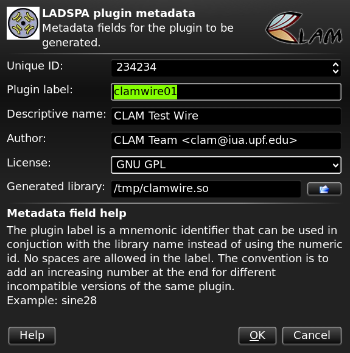

[LADSPA](http://www.ladspa.org/) is the Linux Audio Developer Simple Plugin API. It enables audio effects to be reused across several host applications such Ardour, Audacity, Sweep, Amarok... CLAM can be also LADSPA host but this page just explains how to build a LADSPA plugin using CLAM.

**Notice:** Features explained in this page are not available in CLAM 1.2 or earlier versions.

Using NetworkEditor to generate LADSPA
--------------------------------------

 [CLAM NetworkEditor](Network Editor tutorial) has a new menu command to generate a LADSPA plugin  given a network definition. We recommend to use it unless you need to provide the source files, not just the final binary. You might also need to wrap just a processing object instead a network or to join several plugins in a single library.

The techniques explained below are the ones used by the NetworkEditor that you can do by hand.

SConstruct
----------

All the examples here can be built by using the same template of SConstruct file that is presented in [Building a processing library](Building a processing library) section just by changing the line:

`install = env.Install(os.path.join(CLAMInstallDir,'lib','clam'), libraries)`

by:

`install = env.Install(os.path.join(CLAMInstallDir,'lib','ladspa'), libraries)`

Remember also to change the 'libname' on the top of the SConstruct file.

Exporting a processing
----------------------

If you want to export a given processing (CLAM::AudioAmplifier in the example) as a LADSPA plugin, the following code will do the trick.

`#include `<CLAM/AudioAmplifier.hxx>
`#include `<CLAM/LadspaProcessingExporter.hxx>
`#include `<CLAM/LadspaLibrary.hxx>` `
`static CLAM::LadspaLibrary library;`
`extern "C" const LADSPA_Descriptor * ladspa_descriptor(unsigned long index)`
`{`
`   static CLAM::LadspaProcessingExporter`<CLAM::AudioAmplifier>` a3(library, 3002,`
`           "CLAM Team `<clam@iua.upf.edu>`", "GPL");`
`   return library.pluginAt(index);`
`}`

This will map:

-   CLAM input and output ports in the processing as LADSPA audio ports, and
-   CLAM input and output controls in the processing as LADSPA control ports.

The extra parameters are the numeric id, the maker and the copyright. Label is built by prepending 'CLAM\_' to the processing class name and the descriptive name is built by prepending 'CLAM '. In this example, 'CLAM\_AudioAmplifier' would be the label and 'CLAM AudioAmplifier' would be the text string shown to the user by the plugin host.

Exporting a network
-------------------

Networks can be compiled as LADSPA plugins doing the following mapping:

-   CLAM AudioSources/Sinks in the network as LADSPA audio ports, and
-   CLAM ControlSources/Sinks the processing as LADSPA control ports.

Networks require that you specify more metadata than for a single processing: the numeric id, the string label, a name to present the user, the maker and the copyright.

**Caution:** The network file path specified in the CLAM\_EXTERNAL\_FILE\_DATA macro, is relative to the build working dir not to the source file that contains the macro as it could seem natural. So be carefull if you are not placing the sources in the same folder than the SConstruct file.

`#include `<CLAM/LadspaNetworkExporter.hxx>
`#include `<CLAM/LadspaLibrary.hxx>` `
`#include `<CLAM/EmbeddedFile.hxx>` `
`static CLAM::LadspaLibrary library;`
`CLAM_EMBEDDED_FILE(wire,"wire.clamnetwork")`
`extern "C" const LADSPA_Descriptor * ladspa_descriptor(unsigned long index)`
`{`
`   static CLAM::LadspaNetworkExporter n(library, wire, 3004,`
`           "clamWire0", "CLAM Wire",`
`           "CLAM Team `<clam@iua.upf.edu>`", "GPL");`
`   return library.pluginAt(index);`
`}`

Building more than one plugin in a single library
-------------------------------------------------

You can pack more than one plugin in a given dll. Not by duplicating the ladspa\_descriptor function, which is to be defined only once in a given dll, but by adding more LadspaProcessingExporter's and LadspaNetworkExporter's like in the following example:

`#include `<CLAM/AudioMultiplier.hxx>
`#include `<CLAM/AudioAmplifier.hxx>
`#include `<CLAM/Oscillator.hxx>
`#include `<CLAM/LadspaNetworkExporter.hxx>
`#include `<CLAM/LadspaProcessingExporter.hxx>
`#include `<CLAM/LadspaLibrary.hxx>` `
`#include `<CLAM/EmbeddedFile.hxx>` `
`static CLAM::LadspaLibrary library;`
`CLAM_EMBEDDED_FILE(genderChange,"genderChange.clamnetwork")`
`CLAM_EMBEDDED_FILE(wire,"wire.clamnetwork")`
`extern "C" const LADSPA_Descriptor * ladspa_descriptor(unsigned long index)`
`{`
`   static CLAM::LadspaProcessingExporter`<CLAM::Oscillator>` a1(library, 3000,`
`           "CLAM Team `<clam@iua.upf.edu>`", "GPL");`
`   static CLAM::LadspaProcessingExporter`<CLAM::AudioMultiplier>` a2(library, 3001,`
`           "CLAM Team `<clam@iua.upf.edu>`", "GPL");`
`   static CLAM::LadspaProcessingExporter`<CLAM::AudioAmplifier>` a3(library, 3002,`
`           "CLAM Team `<clam@iua.upf.edu>`", "GPL");`
`   static CLAM::LadspaNetworkExporter n1(library, genderChange, 3003,`
`           "clamGenderChange0", "CLAM Gender Change",`
`           "CLAM Team `<clam@iua.upf.edu>`", "GPL");`
`   static CLAM::LadspaNetworkExporter n2(library, wire, 3004,`
`           "clamWire0", "CLAM Wire",`
`           "CLAM Team `<clam@iua.upf.edu>`", "GPL");`
`   return library.pluginAt(index);`
`}`
