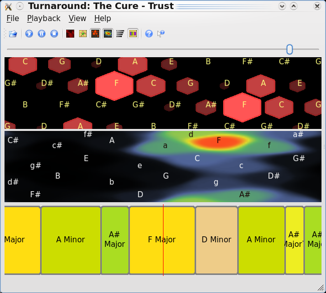
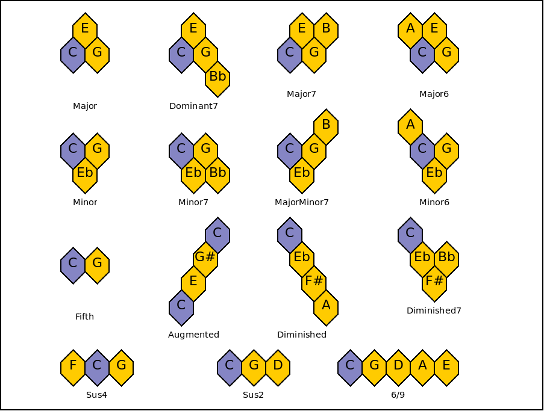

Chordata is an easy to use application, built using the CLAM framework, to analyze the tonal features (harmony, chords...) of your digital music and explore them by navigating along the song using different useful views. It is addressed to amateur musicians who want to know the chords of their favorite songs but it is also very useful to get insight of the music itself. 

Here you can see a video on how it works:

[A video of Chordata in action](http://www.youtube.com/watch?v=xVmkIznjUPE)

Selecting a song
----------------

By clicking on the 'Open' icon , a window will pop up. You can choose any audio file in your hard drive. The application supports many formats: ogg, wav, mp3, flac, aiff... but not wma,

Once you select the song, the application will start to analyze it. Depending on your machine and your operating system that could last a couple of minutes or some few seconds.

As soon as the analysis ends the song starts playing and the views start moving.

Navigating along the song
-------------------------

The usage of the buttons to play , pause  and stop  should be obvious as well as the use of the progress slider to move along the song.

But if you are playing an instrument while looking at the application keyboard bindings would be more useful than handling the mouse.

-   You can play and pause using the space bar.
-   You can stop the song by using the Escape key
-   You can move back and forward by using the left and right cursor keys.
-   You can move back and forward faster by using the PgUp and PgDown keys.
-   You can go to the end and to the beginning by using the Home and End keys.

Understanding the views
-----------------------

Chordata offers many views, each one provides a different insight and has its flaws and strengths depending on the music you listen.

Anyway having many open views is often confusing. Some of them are closed by default to avoid clutter and each view has an icon in the toolbar to toggle it,

Follows the description of the provided views.

### Chord Segments

The chord segment view  shows a guess of which are the periods of time while a given chord is playing. The red bar in the middle shows which is the current time position. Each chord type picks a different color so that you can easily spot the chord sequence.

If the algorithm managed to pick up the chords, this view would suffice to know the chords, but you will notice that, depending on the song, the guess is not very much fiable. This is why chordata offers other views so you can decide yourself.

Chord segments is the nicest visualization in an ideal case. But many things can lead to errors: fast transitions, slow arpeggios, or other elements that make the chord less detectable such as voice decorations, vibratos, slides, distorsion... In most cases the chords are filter out or a chord that is not the proper one pops up.

In such cases the other views help to complement the information.

### Chord Ranking

The chord ranking  displays a sorted list of bars for the likelihood of each chord at each moment. This view is more instantaneous so it will show fast transitions better. Also when the segmentation has assigned the wrong chord, normally the correct one is in the top of the rank so you can see it.

### Key Space

The key space  just displays major (uppercase) and minor (lowercase) chords. They are arranged in the view so that the ones containing with similar notes are in closer positions. A color spot is drop depending on the likelyhood of each chord being played. When a clear major or minor chord plays, you will see a color spot surronding its position.

If the song is playing jsut major and minor chords, this view introduces much less noise than the others which consider 7th, dim...

Other strength of this view is that it maps tonal progressions to spatial movement and such visual association is quite helpful in ear training.

### Pitchgramma

The pitchgram  is like an spectrogram but just containing the pitch likelihood for notes from G to F along time. In this view you can easily view chord progressions or arpeggios that build the harmony of the song.

### Tonnetz

The tonnetz view also displays the pitch likelihood but here pitches are arranged according to tonal relations. The neighbors of each pitch cells correspond to different tonal intervals:

-   to the right: a fifth up
-   up and right: a major third
-   down and right: a minor third
-   to the left: a fourth
-   up and left: a major sixth
-   down and left: a minor sixth

And the minor and major seconds and sevenths are on the four diagonals.

This arrangement maps chords modes to shapes relative to their root note. The following table shows most common chord shapes with C as root.

### Polar Peaks

TODO: Explain the polar peaks view (Help us to complete the documentation)

### Piano View

TODO: Explain the piano view (Help us to complete the documentation)

Due Credit
----------

-   The application itself was developed a [Summer of Code](http://code.google.com/soc/|Google) project by Pawel Bartkiewicz.
-   Processing algorithm inside the chord detection is based on Christopher Harte work.
-   Realtime algorithm enhancements and visualizations by Roman Goj (Summer of Code) and David García Garzón.
-   Algorithm c++ port by Kate Noland and David García Garzón.
-   KeySpace visualization is based on Emilia Gómez and Jordi Bonada code.

