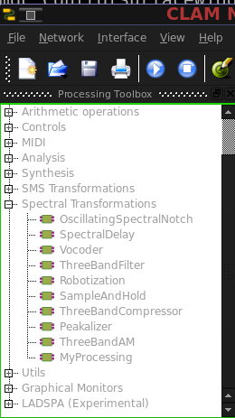

A processing is one of the boxes you can connect on the NetworkEditor. They perform a process on some input data and writes some output data. Sources and sinks for a processing are InPort's and OutPort's. Ports can be templated to any copiable data. Ports cooperate with the flow control to move the data arround.

Although it is not the recommended way, you can also use the processing directly as a function passing the data directly to the Do overload which has parameters.

Here is a minimal implementation of a processing object with a single input and a single output:

    #ifndef MyProcessing_hxx
    #define MyProcessing_hxx

    #include <CLAM/InPort.hxx>
    #include <CLAM/OutPort.hxx>
    #include <CLAM/Processing.hxx>

    // Those two configuration types could be the ones you choose.
    // Your own ones or any type already in CLAM.
    #include "MyInputDataType.hxx"
    #include "MyOutputDataType.hxx"

    class MyProcessing : public CLAM::Processing
    { 
        CLAM::InPort<MyInputDataType> mIn;
        CLAM::OutPort<MyOutputDataType> mOut;
    public:
        const char* GetClassName() const { return "MyProcessing"; }
        MyProcessing(const Config& config = Config()) 
            : mIn("My Input", this)
            , mOut("My Output", this) 
        {
            Configure( config );
        }
     
        bool Do()
        {
            bool result = Do(mIn.GetData(), mOut.GetData()); 
            // Tell the ports this is done
            mIn.Consume();
            mOut.Produce();
            return result;
        }

        bool Do(const MyInputDataType& in, MyOutputDataType& out)
        {
            // Your implementation
        }
    };

    #endif // MyProcessing_hxx

MyProcessing.cxx
----------------

As the class methods get verbose, it is convenient to move the implementation to the cxx. To keep the example short and easy to follow and copy, we kept all the implementations on the hxx.

But, still, what needs always be on the cxx file is the factory registration.

`#include "MyProcessing.hxx"`
`#include `<CLAM/ProcessingFactory.hxx>
`static const char * metadata[] = {`
`   "key", "MyProcessing",`
`   "category", "Spectral Transformations",`
`   0`
`   };`
`static CLAM::FactoryRegistrator`<CLAM::ProcessingFactory, MyProcessing>` registrator(metadata);`

You can blindly copy and change 'MyProcessing' by the name of your actual class and the category. The category is the processing tool box category your processing will appear. The key is the name you can provide the factory to create actual processing objects.

The constructor of this FactoryRegistrator, which is called before main, just adds the Processing Factory instructions on how to create a MyProcessing object when you ask for the label "MyProcessing".

It also relates the Processing to different metadata.

For instance, the 'category' is the category that can be browsed in the NetworkEditor processing toolbox. If no 'category' is provided, such processing can be instanciated by the factory but the NetworkEditor will not display it in the processing tree.

TODO: Explain other used metadata (icon...)

Further reading
---------------

-   [Processings with controls](Processings with controls) If you want the processing to receive or send asynchronous data.
-   [Processings with configuration](Processings with configuration) If you want some aspects of the processing to be configurable.

-   [Building a processing library](Building a processing library) If you want your processing to become part of a CLAM plugin library.
-   [Defining a ProcessingComposite](Defining a ProcessingComposite) If you want your processing to be an aggregation of processings.
-   [Using custom data token types](Using custom data token types) if you want to set the port color, type name... for your custom data type.

