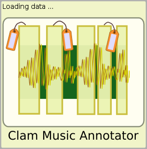
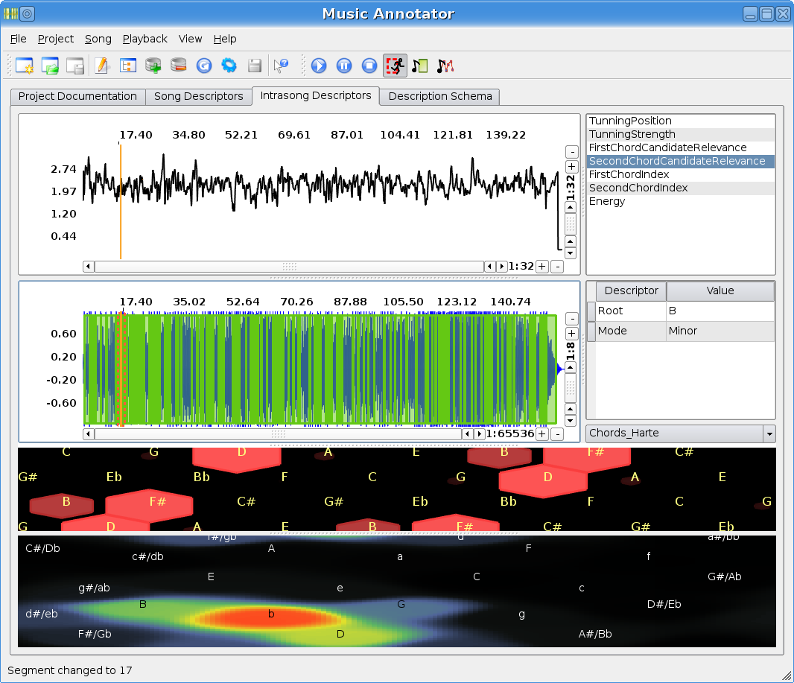
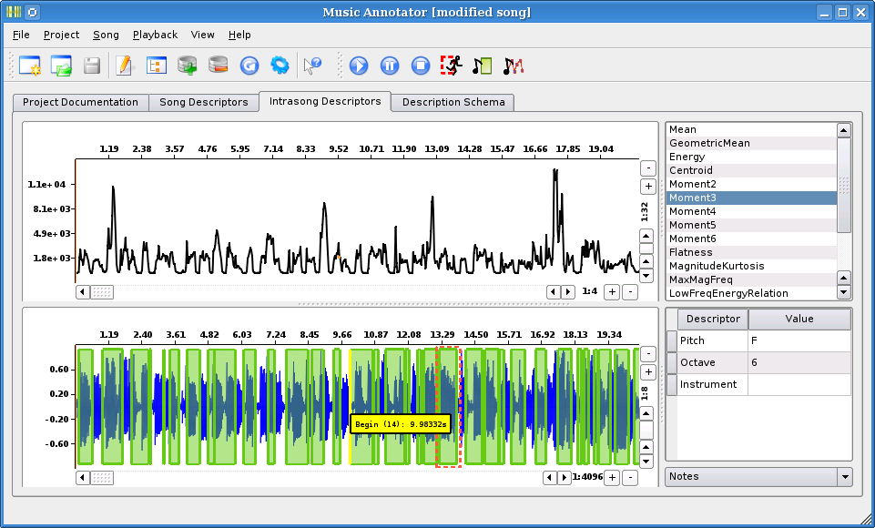
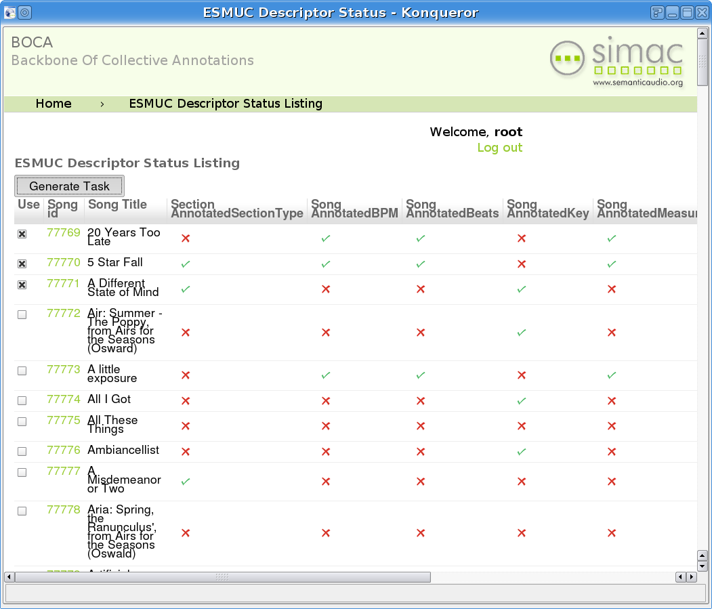
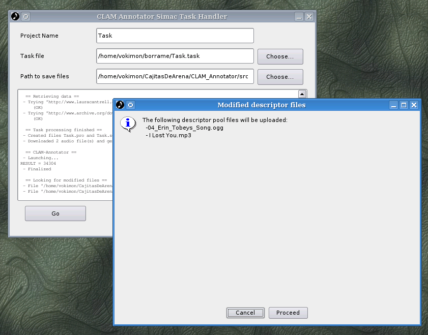

CLAM Music Annotator
====================

Purpose
-------

The [CLAM](http://clam.iua.upf.edu) Music Annotator is a GPL tool that can be used to visualize, check and modify music information extracted from audio: low level features, note segmentation, chords, structure... The tool is intended to be useful for the music information retrieval research whenever you need to:

-   Supervise and correct the results of automated audio feature extraction algorithms.
-   Generate manually edited annotations of audio as training examples or ground truth for those algorithms.

Features
--------

The CLAM Annotator is not tied to a fixed description scheme (the set of attributes). You can define the working attribute set by providing an XML description schema definition. Sample description schemes and an extraction programs are provided with the Annotator but you could implement your own one with different algorithms and attributes. Also tools are provided to select and join attributes from the output of several description sources.

Other key features are:

-   Attribute types:
    -   Free text
    -   Enumeration
    -   Bounded float
    -   Bounded integer
    -   Float array
    -   Frame Division (Equidistant division)
    -   Segmentations (Sizeless, Gapless, Overlapless or Free)
    -   ... more to come
-   Several time segmentations and frame divisions can be defined at once (notes, structural parts, bars, beats, different frame sizes...).
-   Each segmentation or frame division have its own set of attributes to attach to their segments/frames.
-   Auralization for the segmentations (click on the beggining)
-   Auralization for the low-level descriptor (magnitude to freq)
-   Instant views:
    -   [Tonnetz](http://members2.boo.net/~knuth/) for PCP like (tones correlation) display
    -   [Key Space](http://www.iua.upf.es/mtg/publicacions.php?did=337) for major and minor chords correlation
    -   ... more to come
-   Included Extractors
    -   CLAM based low level features extractor
    -   QMUL chord extraction
    -   (see [\#Included Extractors](#Included_Extractors) for details)

Screenshots and videos
----------------------

See the [Annotator screenshots](Annotator screenshots) gallery.

See also the [Music Annotator videos](Music Annotator videos)

Download
--------

Check out the last release at the [CLAM download page](http://clam.iua.upf.edu/download.html).

You may be interested to read those [First steps with annotator](First steps with annotator). It explains how to get the chord extraction working. You can also read the [ Annotator Tutorial](Manual Annotator)

Read the [Music Annotator Changelog](http://clam-project.org/clam/trunk/Annotator/CHANGES) for changes on the new release.

Included Extractors
-------------------

CLAM Music Annotator architecture is open to add extractors and data sources. Just by providing an executable following the proper command line and output conventions. Following command line and output conventions is not a major issue, we have successfully used python to wrap existing extractors that didn't conform.

CLAM Music Annotator comes with several extractors and data sources:

### ClamExtractorExample

The ClamExtractorExample is a simple example of extractor using [CLAM](http://clam.iua.upf.edu). It generates three kind of descriptors:

-   Low level spectral descriptors using CLAM
-   ID3 descriptors
-   Random segments (yes, they are random, just to test the Music Annotator)
-   Random high level descriptors (yes, those are also random)

### ChordExtractor

The chord extractor extracts segments labeled with chords. It uses [Christopher Harte algorithm](http://www.aes.org/e-lib/browse.cfm?elib=13128) with some minor variations. It has been developed as a collaboration between the [Queen Mary University of London](http://www.elec.qmul.ac.uk) and the [Universitat Pompeu Fabra](http://www.iua.upf.edu).

Collective Annotation, the BOCA client
--------------------------------------

 

[BOCA, the Backbone Of Collective Annotations](http://simacservices.iua.upf.edu/boca) is a web application that centralizes collective annotation campaigns. Hand annotation is a hard task for researchers, but, sharing annotations means, as for software, that you'll get more than you are giving.

BocaClient is a program that takes the task files BOCA generates and builds a Music Annotator project by doing queries to the Simac Web Services. After saving the project, the BocaClient uploads the changes back.

Helper scripts
--------------

The source code tarball also includes some python scripts to perform usefull tasks as:

-   Merging pools and schemas from several sources
-   Filtering attributes from pools
-   Mapping attributes names and attribute scopes names
-   Converting [WaveSurfer](http://www.speech.kth.se/wavesurfer) lab files to and from Annotator's descriptors pools

Related Publications
--------------------

-   Amatriain, X. Massaguer, J. Garcia, D. Mosquera, I. 2005. *The CLAM Annotator: A Cross-platform Audio Descriptors Editing Tool*

  
Poster presented at 6th International Conference on Music Information Retrieval; London, UK

[BiBTeX](http://www.iua.upf.edu/mtg/publicacions.php?did=353) [PDF](http://www.iua.upf.edu/mtg/publications/9317d2-ismir2005-clam-annotator.pdf)

-   Herrera, P. Celma, O. Massaguer, J. Cano, P. Gómez, E. Gouyon, F. Koppenberger, M. Garcia, D. G. Mahedero, J. Wack, N. 2005. *Mucosa: a music content semantic annotator*

  
Proceedings of 6th International Conference on Music Information Retrieval; London, UK

[BiBTeX](http://www.iua.upf.es/mtg/publicacions.php?did=344) [PDF](http://www.iua.upf.edu/mtg/publications/189652-ISMIR-2005-Herrera.pdf)

-   Gómez, E. Bonada, J. 2005. *Tonality visualization of polyphonic audio*

  
Proceedings of International Computer Music Conference 2005; Barcelona

[BiBTeX](http://www.iua.upf.es/mtg/publicacions.php?did=337)[PDF](http://www.iua.upf.edu/mtg/publications/9d0455-ICMC2005-GomezBonada.pdf)

