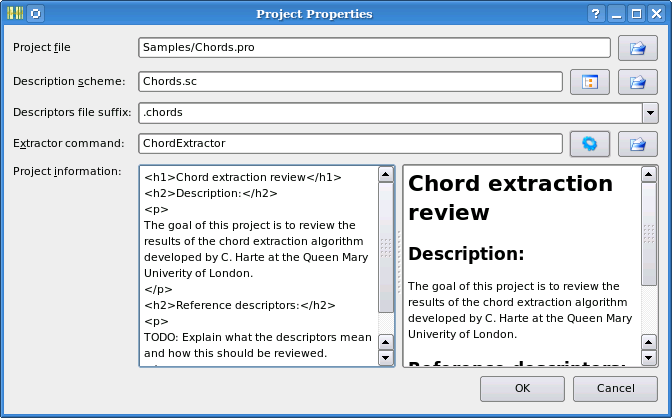
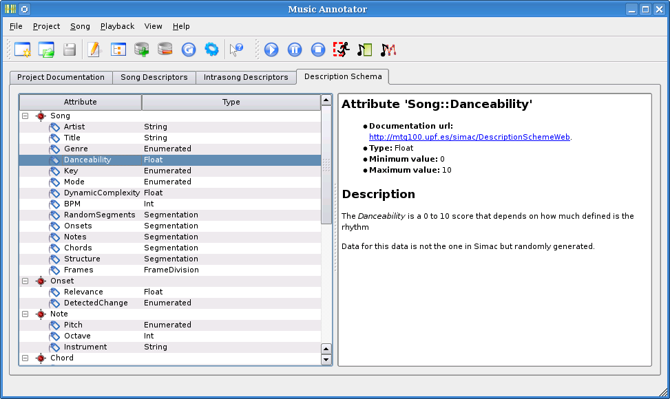
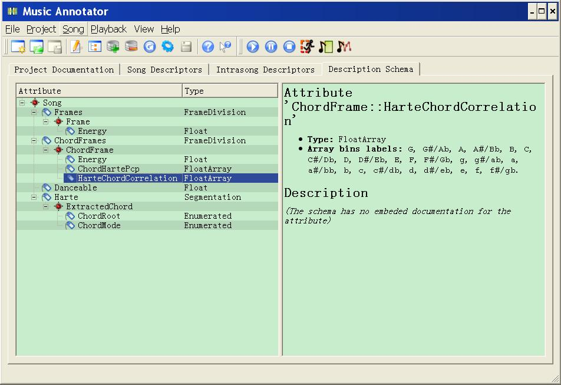

Overview
========

The [CLAM](http://clam.iua.upf.edu) Music Annotator is a GPL tool that can be used to visualize, check and modify music information extracted from audio: low level features, note segmentation, chords, structure... The tool is intended to be useful for the music information retrieval research whenever you need to:

-   Supervise and correct the results of automated audio feature extraction algorithms.
-   Generate manually edited annotations of audio as training examples or ground truth for those algorithms.

Check out the official [Music Annotator](Music Annotator "wikilink") wiki page for more information on the features, screenshots and videos.

A guided tour
=============

This tutorial guides your first steps with the CLAM Music Annotator. **Use the *What's this* button <image:AnnotatorIcon-WhatsThis.png> or Shift-F1 to get additional help for any element on the user interface.**

Using the provided Chord example
--------------------------------

-   Open <image:Annotator-IconOpenProject.png> the **Chords.pro** project from the Music Annotator examples. If your are running on Windows, your browser should be pointing to the right folder, in Linux please drive to /usr/share/annotator/example-data.
-   Go to the **Song descriptors** tab and select a song. Debaser's Wooden House, for example.

[400px|Songs level descriptors and the list of songs](image:Annotator-SongLevel.png "wikilink")

-   Go to the **intra-song descriptors** tab. Click the Play <image:AnnotatorIcon-Play.png> button and you should see the animated key-space and tonnetz views flashing.

[400px|Songs level descriptors and the list of songs](image:Annotator-Tonnetz-Keyspace.png "wikilink")

-   How to interpret those views
    -   The upper one displays some numbers extracted along the chords for each instant. Not that interesting if you are not developing an extractor.
    -   The second view is the one with the detected chord segments. You probably need to zoom in to be useful. When you click a segment it is highlighted and the attributes for the segment (chord root and chord mode) are shown on the right. You can click follow-play button <image:AnnotatorIcon-FollowPlay.png> to change the selected segment with the playback.
    -   <image:Annotator-CurrentSegmentProperties.png>
    -   The Tonnetz view is the one with the hexagons. Hexagons represent sounding pitches, they are arranged in such a way that common chords modes draw identificable shapes, for example the pointing down triangle on the previous screenshot is the figure for a minor chord.  The one on the screenshot bellow is less clear but the main hexagons are C and G and, because Eb is not lighten but E is, it is probably a C major (a triangle pointing up). Use the context help to see a list of common shapes.
    -   <image:Annotator-TonnetzDetail.png>
    -   The KeySpace view is the one at the bottom. It displays the instant tonality which matches with major and minor chords. Chords sharing pitches are arranged closer so the stronger one can be identified better by contrast. Note that this view only displays major and minor chords.
    -   <image:Annotator-KeySpaceDetail.png>

Analyzing the chords for our own songs
--------------------------------------

So you want to analyze your own song.

-   For this task you can use the Chords project example.
-   Go to the **song descriptors** tab and do: **Project, Add Song to Project** <image:AnnotatorIcon-AddSong.png>.
-   Select the new song, ignore the error message and click **Song, Compute Descriptors** <image:AnnotatorIcon-ComputeDescription.png>
-   Wait until the execution ends and then click **Song, Reload Descriptors** <image:AnnotatorIcon-ReloadDescription.png>
-   Once reloaded, proceed as before.

Building a project from scratch
-------------------------------

Before creating a new Project let's take a look how the previous project was defined.

-   Open the previous project
-   Click the **Project Properties** button <image:Annotator-IconProjectProperties.png>.
-   A dialog will appear with the basic parameters for the project
-   
-   Lets review the parameters
    -   The *project file* is the file that contains those parameters, the list of songs and the view configuration.
    -   The *description schema* is a file that describes which are the working attributes in your project. You can build it by hand or you can use the extractor to generate it (see below).
    -   The *description file extension* is the suffix that will be appended to the song file name to obtain the description file name. Descriptions will be stored in a file that is on the same folder that the song file it they have a file name resulting of appending such a suffix.
    -   The *extractor command* is the command used to extract the chords. This project has the `ChordExtractor` command which is one of the extractors that come with the program.
        -   Remember that every extractor has its own schema.
        -   Given an extractor you can use a command line option to generate a description scheme file conforming its output such as: `MyExtractor -s MySchema.sc`
        -   You may not provide an extractor and just edit the descriptors yourself by hand
    -   You can additionally add some *project documentation* in html that will be shown when you open the project. This has use for annotation purposes to write on the annotation criteria.

Examples projects may be placed on system folders not writeable by normal users. Thus, by creating our own one, we could save the modifications and the like. So, now that we know which are the project parameters, let's define our own one.

-   Click the **New Project** button <image:Annotator-IconNewProject.png>.
-   Choose a proper location and name for the project file.
-   After that, the previous dialog will appear with the default values.
-   Change the extractor to be `ChordExtractor` and the description file suffix `.chords`.
-   Once you have defined all that, you can add songs to your project and compute them

Adding views to the project
---------------------------

But, in contrast to the example project, the project we built from scratch has no Tonnetz neither KeySpace views. To add them we should use the **View/Add Instant View** menu. After selecting a kind of view, you should choose an attribute in the schema to apply it to. Only attributes that support this kind of view will appear.

-   Apply the Tonnetz view to the Frame::HartePCP
-   Apply the KeySpace view to the Frame::HarteChordCorrelation

If you want to compare two different low level descriptors or two different segmentations you could also add new panes with **View/Add Low Level View** and **View/Add Segmentation View**.

Editing the description
-----------------------

If you don't like the result of the extraction, some descriptors can be edited.

You can edit song and segment attributes. When you click on the value it enters into edition mode. Depending on the kind of attribute the way of editing it may change.

You can also edit segmentations, not just segment attributes.

-   Move and resize segments by dragging its limits.
-   Insert a new segment by pressing the insert key and clicking at the desired begining position.
-   Delete segments by selecting them and pressing the delete key.

Depending on the kind of segmentation some helpfull restrictions apply on edition:

-   Overlaping: You may create segments with no restriction
-   Discontinuous: Segments don't overlap, so you cannot move a limit further than another one's limits.
-   Continuous: There can be not gap. So the beginning of the segment and the ending of the previous one move together.
-   Sizeless: the begining and the ending of the segments move together.

And finally, you can edit low level descriptors by dragging the values of the plot.

Using the CLAM extractor example
--------------------------------

Now we will use the other extractor provided with the program: `ClamExtractorExample`

-   Create a new project with the extractor command being `ClamExtractorExample`
-   Be carefull to choose a different description file suffix in order not to overwrite descriptions generated by other extractors.
-   Once you have defined all that, you can add songs to your project and compute them

`ClamExtractorExample` extracts four groups of descriptors

-   ID3 descriptors that you can see at the Song Description tab.
-   Low level descriptors
-   Randomly generated song level descriptors (just for testing)
-   Randomly generated segmentations and related attributes (just for testing)

Understanding the description schema
------------------------------------

Let's take a closer look to what the description scheme defines. You can acces the Schema Browser by selecting the Schema Browser tab, or by clicking the **Browse Schema** button .

The description scheme defines two kinds of entities: *Attributes*  and *scopes* . Attributes are the actual value holders, and its validity is limited to a given scope. For instance, the pitch may be an attribute and the note, its scope.

Each attribute has a type (String, Enumeration, Float...) and some meaningfull parameters for the type. For example, a Float (real number) may have units, upper and lower bounds, a default value... You can see all those parameters on the right pannel when you click an attribute on the left. Some attributes also provide some description of their meaning.

Two kinds attribute deserve a deeper explanation: `Segmentation` and `FrameDivision`. They are used to connect a parent scope with a child scope. Click on some attributes of those types and check, on the right parameters, which child scopes are relating.

-   **Segmentation** attributes are used to define arbitrary time segments or time marks: Note onsets, notes, break points, chord regions, song structural parts... The segmentation attribute defines the boundaries and the child scope defines the other attributes for the region. Segmentation hold a 'segmentation policy' attribute which sets the restriction on the segments definitions:
    -   **Overlaping** segmentation may contain segments that overlap and regions with any segment.
    -   **Discontinuous** segmentation can have gaps but segments can not overlap. Every point has one segment or none.
    -   **Continuous** segmentation doesn't allow gaps. One segment ends when the next starts.
    -   **Unsized** segmentation consists on marking points with no duration.
-   **FrameDivision** attributes define equidistant points in time. Child scopes for that attribute are used mainly to store values that happen for every instant in the song, such the energy, the spectrum...

Using the Aggregation extractor example
---------------------------------------

The aggregation extractor is usefull whenever you need to combine descriptors of several extractors into one project. This section explains how to setup such a project.

-   Create a new project with the extractor command being `AggregationExtractor` script.
-   Again, be carefull to choose a different description file suffix in order not to overwrite descriptions generated by other extractors
-   Select or edit a configuration file
    -   a configuration file specifies sources and mapping information for the aggregation extractor. The example configuration file- /example-data/AggregatorConfig.conf can be refered.
    -   you may also edit the selected configuration file by clicking the edit button. Notice that by far there are several DON'Ts for editing the sources and mapping, such as:
        -   - miss the SourceScope::SourceAttribute of "Song::Frames", which should be always specified
        -   - include the parent attribute of an included scope which is not toplevel
        -   - have Two attributes coliding in the same one
        -   - have attributes from different scopes joined in the same scope
        -   - Use inexistent attributes
        -   - ...
-   Once you have defined all that, you can add songs to your project and compute them with aggregation extractor.

`AggregationExtractor` extracts the specified descriptors by calling the specified sub-extractors according to the configuration file.

Building your own extractor
---------------------------

Of course, you may use a third party extractor or your own one, just by using the commandline conventions defined by extractors, and writting the output on the specified format. Authors have used successfully shell and Python scripts to just adapt third party extractor programs to those requirements.

Commandline requirements are the following ones:

`MyExtractor  [-w] [-c <`*`configfile`*`>] [-s <`*`schema.sc`*`>] [-f <`*`.suffix`*`>] [<`*`song1.wav`*`> [<`*`song2.mp3`*`> ...]]`

-   `-s <schema.sc>`: should write a description scheme to `schema.sc`
-   `-f <.suffix>`: should use `.suffix` as suffix for the description files. The default should be `.pool`
-   `-c <configfile>`: should take that file as configuration. If not provided the extractor should set the default configuration.
-   `-w`: should write back the descriptors to backend sources instead of querying them (See bellow).

You should expect on the input any format supported libsndfile (AIFF, WAV, AU, VOC...), MP3 and Ogg-Vorbis. And the output should match the XML format of the examples.

When in write back mode, most extractors will simply exit with success. It is needed just if the extractor depends on a backend that must be updated with the user edited values: a database, a web service...

On any error the extractor should display the error on the standard error and exit with a return value different to 0.

TODO: An option to get the default configuration.
