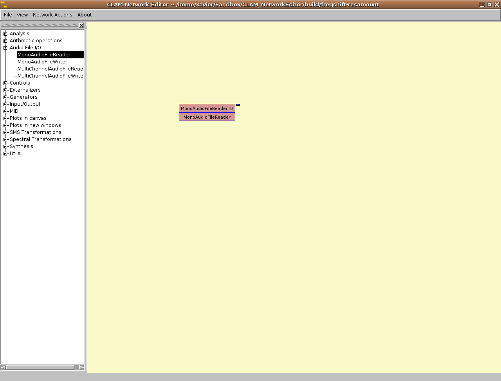

CLAM visual builder's name is NetworkEditor. It is a patching tool to graphically connect processing units in a *network* that you can use as the processing core of you application. CLAM also provides Qt Designer integration, so you can also build graphical interfaces that nicely interact with such processing core. You can even combine both, Qt Designer and CLAM NetworkEditor, to fully build standalone applications and plugins without writting any code at all.

In the present tutorial we will learn the main features of the NetworkEditor step by step.

Setup
-----

-   Linux: the recommended audio backend is JACK. It is automatically selected if the JACK server is running. Use qjackctl to start it and use the 'Connect' tool to connect inputs and outputs as desired.
-   Windows: we recommend the PortAudio backend which is selected by default. You should select with the Windows Multimedia Mixer the input to fed to the NetworkEditor: 'microphone' or 'mixed stereo' when you want to process the audio output of other program such a multimedia player. **To prevent annoying feedback noise, do not use the 'mixed stereo' when the network has also output.**

A quick example of the workflow
-------------------------------

To see the power of the CLAM Network Editor let's start by taking a look at one of the provided example and following the normal workflow.

-   Start the NetworkEditor. You will see an empty canvas like this:

-   Check that you can see the icon of the recommended audio backend for your platform at the lower right corner.
-   Choose the menu option *File-\>Open example*
-   Select the network file named `SMSTransposition.clamnetwork`.
-   Resize the window and use the zoom buttons  or the mouse wheel to make the network fit:

-   Setup your platform so that you get the input from the microphone and the output goes to the speakers.
-   Press the space key or the Play  button to start the network.
-   Talk to the microphone while moving both sliders. You will see something like this.

-   After playing a little, stop it by pressing the Esc key or the Stop  button to stop the effect

That network will be the core of our application. We need an interface, we can build it using the Qt Designer. The Qt Designer is a free software tool that is part of the Qt development framework from Trolltech. You can graphically build user interfaces. CLAM provides a plugin that enables some CLAM related plugins to be used in such interfaces. We'll take an already done interface but let's see how does it looks like with Qt Designer.

-   Run Qt Designer
    -   Windows: There is an icon on the same Start menu folder where the Networkeditor is.
    -   Linux: Run the command `designer-qt4`.

-   Assure that the CLAM Widgets group is available at the end of the Widget Box on the left. This group contains CLAM provided widgets that can be linked to the network processings (and what if it is not? copy libCLAMWidgets.so to /usr/lib/qt4/plugins/designer/ .).

-   Load the file `SMSTransposition.ui` from the NetworkEditor examples folder.

-   Check on the 'Object Inspector' that some of the widgets names are related to the processings names on the former network. This is what we use to bind the interface elements to the processing elements. You can obtain such name by using the 'Copy connection name' option on the connectors context menu.

Now that we have an interface, let's run it with the Prototyper. The Prototyper is an application that loads both, the CLAM network and the Qt interface and run its as it were an standalone application.

-   Windows: you may need to close the NetworkEditor, if you didn't before, to free the devices.
-   Run the Prototyper from the Start menu.
-   You will be asked to choose a network to run, so choose `SMSTransposition.clamnetwork`.
-   After some initialization this application will appear:

-   Linux: after the application starts, you will need to connect properly the inputs and outputs as you did with the NetworkEditor.

Feel free to try other provided examples both with the Prototyper and the NetworkEditor. There is no problem running networks without interface because Prototyper will provide a default one.

Building Networks
=================

Creating the simplest Network
-----------------------------

Now we know the workflow, but we are cheating because we took already done networks. So let's build a network from scratch, the simplest one.

-   Select File-\>New on the NetworkEditor. You will get a blank canvas again.
-   Now we are going to add a number of Processings. A Processing object is the basic building block in CLAM. Processings are listed on the left hand menu in the NetworkEditor, grouped by categories. Click on the Audio File I/O Category in order to expand the view and see what Processings are available.

-   Click on the MonoAudioFileReader and drag it to the canvas on the right side. It should now look like this:

-   The Processing is "red" because it is not "configured" properly. If any Processing in the network is not properly configured, the network cannot be started. Let's fix that. Pass over the processing with the mouse and a tooltip will show the configuration error message. In this case, we did not selected a file to read.

-   Processing configuration is accessible from the popup menu that appears when you right-click the processing.

-   Choose 'Configure' and it will open a configuration dialog.

-   Click on the "..." button and select an audio file from your hard drive.
-   Assure you have the 'Loop' option also selected.
-   After clicking ok on the configurator, the Processing should be in Green now.

-   Now you can run this network by simply selecting Network-\>Play. All you can see is that the Playback status down on the right says *Playing* but no sound is produced. That is because we have still not added an audio output!
-   Go to the *Audio Input/Output* category and drag an AudioSink processing object.
-   To connect both processings just drag a wire from one round connector (port) to the other.

-   Port connection is not allways feasible. Ports communicate data of several types of data. You can not connect ports which do not share its data type. While dragging a wire, ports that are not compatible are highlighted in red instead of green.

 

-   To disconnect a port, use the context menu for the connector (right click the port).

-   Reconnect the ports and play the network. You will hear the sound file you selected.

Visualising data
----------------

-   Another interesting thing we can add to our network is a visualisation of the audio that is being played. For that purpose we will use the Oscilloscope in the 'Graphiclal Monitors' category. Graphical monitors are an special kind of processing that displays incoming data.
-   Data is displayed in the box. As it is too small you need to resize it by dragging the lower right yellow corner. You can also move the processing by dragging the name caption.
-   Connect the input Port of the Oscilloscope to the output Port of the MonoAudioFileReader. Start the Network, you should be able to see the audio being read:

-   Right now we only can use audio monitors. Later on we'll see other types of data that can be also viewed.

Saving and loading networks
---------------------------

-   We have put too much work into this network just to risk loosing it now! We should save it somehow. Select File-\>Save and choose the location and name you want.
-   If you are wondering what the file looks like go ahead and open it with your favourite text editor. Note that it is a regular xml file that is easy to edit and export and should look something like this:

This file specifies all the Processings, connections and configurations.

-   If you feel adventurous you can go ahead and edit some of the values and then load the xml from the NetworkEditor.

-   If you want to do batch editions of a network, you could process the XML files directly, but CLAM provides a Python script 'clamrefactor.py' to safely perform high level operations such:
    -   setting configuration values
    -   processings renaming,
    -   class renaming,
    -   configuration parameters renaming and reordering,
    -   connectors renames,
    -   ...

For example, the following command sets the Filename of the previous network:

`scripts/clamrefactor.py -c "setConfig MonoAudioFileReader_0 SourceFile MyAudio.ogg" mynetwork.clamnetwork`

The Spectral Domain
-------------------

-   In order to do more interesting things we will now turn into the spectral domain. We can analyze the audio signal to obtain an spectrum, a frequency domain representation of the signal. The spectrum can be modified in a wiser way than time domain audio signal and then resynthesized back.

-   So, delete the connection between MonoAudioFileReader and AudioSink. Drag a SpectralAnalysis from the Analysis category and a SpectralSynthesis and a OverlapAdd from the Synthesis category. Connect them as shown:

-   OverlapAdd is used for smoothing out the resulting audio frames.

-   Now you need to configure the Processings appropiately. We won't go into the DSP details but you are more than welcome to try with different values (be careful to save the network every step you take because in its current version, a wrong setting will produce a program abortion).

Here you have a screenshot of the three configurations (SpectralAnalysis, SpectralSynthesis and OverlapAdd).

-   In order to finish this section we are going to add a couple of monitors that can give us more useful information. We will add an SpectrumView to the output of the SpectralAnalysis and reconnect the Oscilloscope to the output of the OverlapAdd, just as shown:

-   Note that you cannot connect the SpectrumView to audio ports, just to the ones that feed spectrums.

Transformations and Controls
----------------------------

-   Now that we know how to get exactly the same audio that we had at the beginning, how about playing around a bit with it? You can in fact select any transformation from the SpectralTransformations category, but in order to start small, we will use the SampleAndHold. Connect it as shown on the figure and add an SpectrumView to the output of the effect:

-   If you start the Network you will see its very clear effect! The spectrum is frozen on fixed intervals so you get a rhythmic artificial sound.

-   But, how can I control the way the transformation behaves? Did you notice a red square on the top of the Processing? That is what in CLAM is called a "Control". Controls are used in order to receive and send asynchronous events (such as those coming from a slider,etc...). So all we need to do is to learn how to send values to this input control. Go to the Utils category and drag an OutControlSender.

-   Once in the canvas right click to bring up its configuration and set it up as shown below:

-   Now connect the slider to the input control in the SampleAndHold and resize the control as needed. It should look like:

-   Now you are ready to start the network and play around with the slider in order to affect the way the effect behaves.

-   Finally it is up to you to try out the different Spectral Transformations and see what they are capable of doing. Not that you can even chain different transformations one after the other.
-   The spectralTransformation.clamnetwork example is an effect chain consisting on: a three band filter, a robotization effect and a OscillatingSpectralNotch which amplifies an oscillating band of frequencies.

Convenience tools
-----------------

There is a number of convenience tools the NetworkEditor has added lately to enhance the usage. One is the quick processing add shortcut. By pressing Ctrl+Space you get an small dialog you can type the processing name in with completition. Very usefull once you start knowing the processing repository.

Also now the ports and control provide a colouring code to highlight the token type of the port, and if you hover them you get extra type information on the tooltype.

The port context menu provides some shortcuts to link common processings:

-   Sources and sinks
-   Monitors
-   Whichever compatible port already in the network

Also, double clicking a control or a port you get a connected default processing. In the case of controls, it is a control sender for the in controls and control display/printers for the outputs. By double clicking a port you will get the proper source or sink.

Other convenience tool is the multi-wire dragging which is activated by pressing the control key while dragging a port. This is very useful when connecting processing with many ports.

Building Prototyper interfaces
==============================

As we saw at the beginning of the tutorial, the Prototyper is a utility that wraps a network definition under an interface to build an stand alone application. The interface can be prototyped visually so **no compilation, and no programming is involved.**

Interfaces can be designed with a nice tool, the Qt Designer, which comes with the QT library by Trolltech. Designer is used to layout graphical elements (widgets) on an interface. Those includes some widgets that CLAM provides to visualize sound related data and control the processing.

Widget names are used to relate the processing and the interface elements. At the NetworkEditor, you can use contextual menus for ports and controls to get the binding names for the widgets you want to attach.

Name bindings:

-   InControl\_\_<em>ProcessingName</em>\_\_<em>InControlName</em>:

  
For sliders and knobs, sends integer numbers to the in control

-   InControlFloat\_\_<em>ProcessingName</em>\_\_<em>InControlName</em>

  
The same as the previous one but sends double by dividing by 100

-   InControlBool\_\_<em>Processing</em>\_\_<em>Control</em>:

  
For check buttons (Radio buttons, check boxes or

-   AudioFile\_\_<em>ProcessingName</em>:

  
Binds buttons with MonoAudioFileReaders, on click opens a file selection dialog.

-   PlayButton:

  
Starts the network on click

-   StopButton:

  
Stops the network on click

-   BackendIndicator

  
To be bound to a Label. It adds a indicator of which backend is used.

-   PlaybackIndicator

  
To be bound to a Label. It adds a indicator that says whether the network is playing.

When adding the names, you must change any space into a triple underline.

Using prototyper with the default interface
-------------------------------------------

Let's take a simple file player network such as the one we had at the first steps of the tutorial. The one with a MonoAudioFilePlayer and an AudioSink. Assure that the audio file is properly configured and save the network as `MyFilePlayer.clamnetwork`.

If we start the Prototyper and choose that network, we'll get a simple interface that is provided by default.

It is a very simple interface which starts and stops the network and provides some information on the playback status and the used audio backend (jack, portaudio...).

Replicating the default interface with Qt Designer
--------------------------------------------------

Let's reproduce the same interface by our own using Qt Designer.

-   Open the designer and create a new dialog without buttons.
-   Drag and drop three push buttons from the widget box to the dialog.

-   Double click each one to change the text to 'Play', 'Stop' and 'Close'
-   Click on the dialog to clear the selection and press the 'Lay Out Vertically' icon  to have the buttons stacked.
-   Resize the dialog. Notice that the layout makes the widgets to be organized properly whatever the dialog size.

-   Let's add some behaviour. Press the 'Edit Signal/Slots' button  to get into that edition mode.
-   Drag a connection from the 'Close' button to the dialog background.
-   A dialog will pop up. Select the 'clicked()' signal to the 'accept()' slot and press 'Ok'.

-   This way we are saying that whenever the 'Close' button is clicked the dialog will be accepted (closed without error).
-   Go back to the 'Edit widgets' mode .
-   To try the connection, launch a preview by pressing Ctrl-R. Push the Close button and the dialog will close :-)
-   The preview doesn't binds a network so no sound will play. To run it with a network inside save the dialog in the same folder than the network as `MyFilePlayer.ui`. Note that the file names match but the extension.
-   Now call the Prototyper and choose the network again. It should show our new interface but now the audio is playing. The problem now is that play and stop buttons are useless. Let's connect them!
-   Right click the Play button and choose 'Change objectName...' and name it 'PlayButton'.

-   Do the same with the Stop button and name it 'StopButton'.
-   Save and launch again the prototyper. The Prototyper has identified the buttons names and now we can control the playback with them. Great!
-   Now, the only way to know whether the network is playing or not is by listening. We can drop a Label into the dialog and name it 'PlaybackIndicator'.

-   If we save it and launch the prototyper again, we'll see that Prototyper fills the label with the playback status.

-   A different label but named 'BackendIndicator' would show the audio backend (Jack, PortAudio, VST...) in a similar fashion.

Controlling the layout
----------------------

At this point we have the same functionality that the default prototyper interface provides. As the interface is gonna get harder i recommand you to play a little with layouts before moving forward.

-   Break the dialog layout  to free the widgets
-   Select both Play and Stop buttons and click 'Layout Horizontally' 
-   A red box is surrounding them now. Do the same with the two labels.
-   Click again on the dialog background and click 'Layout Vertically'  to set the top level layout.

-   You can combine such layouts to get complex designs.
-   Splitters  provide a similar way of stacking but they enable the user to change the size proportions.

Visualizing data
----------------

-   Drag an Oscilloscope from the widget box. Resize the dialog if it has become just a line.

-   As we want the oscillator to expand vertically but not the indicator labels, we change the SizePolicy attribute of the labels in the property editor.

-   Open the network with the NetworkEditor if you closed it.
-   Right-click the output port of the MonoAudioFilePlayer and choose 'Copy Prototyper Name'. This puts the binding name on the clipboard.

-   Go back and change the name of the Oscilloscope. Delete the old name and paste the clipboard content. Something like `OutPort__MonoAudioFileReader__Samples___Read`
-   Save and run the Prototyper. You will see the sounding wave instead of the static sinusoid that is shown on the designer.

Now let's tweak the oscilloscope properties to make it look nicer. Use the property editor to set somethin similar to this:

-   autofillBackground: true
-   styleSheet: background-color: \#aff;
-   lineColor: just pick one by clicking on the color value

Adding a file chooser
---------------------

For sure we are feed up of listening the same song again and again. Let's add a button to change the music.

-   Drag a PushButton with text 'Open Audio File'.
-   Let's name it `AudioFile___<em>MonoAudioFileIn</em>` in order to bind with the file reader processing <em>MonoAudioFileIn</em> (use the proper name if your processing name is different).

Adding a volume control
-----------------------

Now we want to add a volume control to our player. Firstly let's insert the processing that will perform such task. It is the AudioAmplifier found at 'Arithmetic Operations' category. Insert it this way:

Although is not needed for our network you can add a controller slider using the context menu on the amplifier's control.

Next we'll edit the interface to include a vertical slider. It's not a CLAM widget, an standard Qt slider. To make up this layout you should break the top level one, then select former widgets, press to the *vertical layout*, then clicking on the background and press *horizontal layout* to make that the top level one, so that all the old widgets and the new slider are layed out horizontally.

Notice that the control bounds are displayed on hovering the control. This means that the programmer of the processing has set a range for such a control. In this case, Prototyper will adapt the slider range to adapt the controls one just by binding it.

The binding is done similarly to the port binding: Copy the control name and paste it as the name of the widget.

You can enhance your network by binding a Vumeter widget to the output of the amplifier, this way you can see if you still have room to amplify without clipping.

Controlling the stylesheets you could get a fuzzing nice player. Style sheets not only let you control colors but also pixmaps, so your player is stylable as XMMS or WinAmp!! Read the [Qt Stylesheets manual](http://doc.trolltech.com/latest/stylesheet.html).

Algorithms
==========

In this chapter of the tutorial we will get more insight on the algorithm families that are provided with CLAM and standard plugins.

3D Spacialization
-----------------

'spacialization' plugin includes some processings for 3D sound. Such plugin enables real-time simulation of room acoustics for a moving listener and a moving sound source. It encodes the simulation results in the so called B-Format (pressure+velocity vector components). To reproduce the 3D sound you can use several processings that decode such format to several exhibition formats such as 5.0 Surround, N-Surround and Binaural.

At the moment, this tutorial just covers how having the most interesting network working to explain and demonstrate the technology. The [spacialization plugin README](http://iua-share.upf.es/svn/clam/trunk/CLAM/plugins/spacialization/README) file makes an extensive explanation of the included processings and networks.

Such processings need several data packages not distributed with CLAM but available at the [data download page](http://clam.iua.upf.edu/download/data/).

Spacialization plugin require two kinds of databases:

-   Room point-to-point hyper grid of simulated impulse responses
    -   data18.zip contains four databases for the same room and four fixed sources
    -   Unzip it and rename (or link in unix) any db18/sourceX directory as 'db' in a working dir.
-   Head related impulse responses for different source orientations in a polar grid.
    -   MIT\_KEMAR\_HRTF.zip contains such a database meassured with a [KEMAR manikin](http://www.gras.dk/00012/00330/).
    -   Unzip it directly at the working dir.

-   Open the following example network:

`impulse-response-database-surround-to-stereo.clamnetwork`

-   If some processing is red probably means that relative paths on their configurations doesn't match. (Remember NetworkEditor is though to be used with a given working dir where the databases have been setup). Edit the configurations to fix the paths or run the NetworkEditor with such a working dir.
-   Connect your backend so you are feeding the input with a continuous sound (Jack in linux or feeding some mic.
-   You can move the source and listener position by draging the red points on the pads. (In the sample database there is just one source position so source navigation has no changes).
-   You can also turn your head by moving the orientation slider

The upper left section of the network chooses the P, Vx and Vy components of a point on the grid and convolves each one with the input audio. Notice that there is a double line of each component. The second line corresponds to a one frame delayed impulse response, so that whenever the impulse response changes, we can crossfade audios with the new and changed impulse response to obtain smooth transitions.

Once we have the B-Format components (P,Vx,Vy) they are feed to a N-Surround decodec. The output of such a decodec could be feed to an N-Surround installation (N equiangular speakers) but what we are doing is convoluting every output with the HRTF for the speaker position and adding it to get the output of each binaural signal, left and right.

TODO: Spectral Modeling Synthesis
---------------------------------

Besides the regular STFT (Phase Vocoder) implementation, CLAM also has implemented the Sinusoidal plus Residual Model (a.k.a. SMS). That model identifies the sinusoids (the tonal part) on the spectral representation and substract them to get residual (the noisy part). By doing so, we can process both components separatelly so even more interesting transformations can be implemented with that model.

Tonal Analysis
--------------

Tonal Analysis is a module and a set of visualizations that provide information about the tonality of a song, including 'instant tonality', meaning the chord. Chordata is a full application distributed with CLAM that uses it, but you can use the components to build your own. Chordata demonstates that although Prototyper is limited to realtime appliations once you prototyped a real-time application, very few code is needed to add extra logic make this work, for example, as a exploration tool where the data does not come from a RT process but from a dumped data repository.

")

A processing named 'TonalAnalysis' is provided which does all the processing. It hides a more complex network shown in this figure:

When you drop a 'TonalAnalysis' to the canvas, It might freeze for a moment due to its heavy load initialization. Don't worry about that.

That processing provides different bits of information at the ports:

The algorithm starts by doing a [Constant Q transform](http://en.wikipedia.org/wiki/Constant_Q_transform) so that we get three bins per semitone. All the octaves are folded (added one to one) into a single octave. Then all the peaks of that circular spectrum are detected. What we get is the ChromaPeaks outport. It can be visualized by a PolarChromaPeaks view.

After folding ChromaPeaks again but now within a semitone, presenting them in polar coordinates and summing them as vectors, we get the tunning vector, that tells us how far are we from a A-440 pitch. The module gives a magnitude on how pitched is the sound while the orientation tells us how tuned is that pitch. The tuning vector can be visualized using the Tunner view.

Then, the Choma peaks are corrected to the standard tunning and a Pitch Profile is built containing the amount of energy for each pitch note. We can display this with the VectorView which is a plane BarGraph, but two other visualization are provided: Spectrogram, that applied to the pitch profiles provides nice time evolving plots and the Tonnetz view which display tonal compatible pitches together so that common chords modes have characteristic shapes.

  

The next output we can take from the analysis is the chord correlation. This is built by adding the pitch by pitch product of the resulting pitch profile with a collection of ideal profiles for the different chords we want to try. This gives us, for each chord the probability of being the one sounding in a given instant.

We can display that using several views: The keyspace view arranges major and minor chords in a torus so that chords with sharing pitches are together. This view gives you a nice picture on how the pitches evolves.

The other view we can use to display the Chord Correlation is the Chord ranking. It is a bar graph with the chords sorted by probability. It is more noisy than the KeySpace but it provides two bits of information KeySpace doesn't. First, shown chords are not limited to major and minor, and second, you can easily see how clear the most probable chord is versus the other near options.

All the previous views were computing taking into account just the information in a single frame. This information is not as steady as it should to get an idea of which is the played chord. Some post processing must be done to get some long lasting segments. The output of this post processing is the Segmentation which has its own visualization too.

") All those views are available in the CLAM plugin for Qt Designer so you can assemble a prototype similar to Chordata but working on realtime taking the mic as input.

The original algorithm was defined by Chris Harte. In David Garcia Master Thesis one can find further discussion on implementation details and differences with the original Harte's algorithm.
