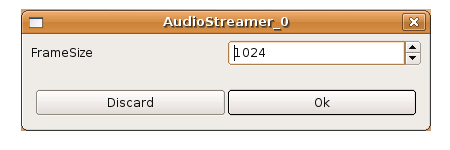

TODO: This howto is work-in-progress.

If you have a processing object and you want it to behave differently given some configuration parameters, you should provide a configuration object containing such parameters and implement the configuration method to respond to parameter setting.

Defining a configuration object
-------------------------------

Configuration objects in CLAM must be a special kind of object called DynamicType. DynamicTypes provide, among other things, **automatic interface generation** to edit their properties on the NetworkEditor and **XML serialization** to dump store and restore configuration as part of the clamnetwork XML file.

This is an example of configuration object definition:

TODO: Paste a simple example here

`class MyProcessingConfig:public CLAM::ProcessingConfig`
`{`
`    DYNAMIC_TYPE_USING_INTERFACE( SimpleConfig, 1, ProcessingConfig );`
`    DYN_ATTRIBUTE( 0, public, int, FrameSize);`
`protected:`
`    void DefaultInit()`
`    {`
`          AddAll();`
`          UpdateData();`
`          SetFrameSize(512);`
`    };`
`};`

The DefaultInit method is where default attributes are added and initialized with a value. This is automatically called from the constructor. **Troubleshooting:** If the plugin is not loading in NetworkEditor, check that "*DefaultInit()*" is defined (versus only declared: *DefaultInit();*)

Once stored in XML format from the Network Editor, the Processing object that has this kind of configuration will read like this:

<processing id="SimpleProcessing_0" type="SimpleProcessing">
`   `<FrameSize>`1024`</FrameSize>
</processing>

And the automatically derived configuration widget will look like this:

Using your configuration object in the processing
-------------------------------------------------

-   Define a inner type alias MyProcessing::Config for your configuration
-   Add an 'Config mConfig' attribute to the class
-   Implement the GetConfig method to return such object
-   Implement the ConcreteConfigure method to be called every time it is provided a new configuration.
-   In such a method, firstly use the CopyAsConcreteConfig method to copy the object

`class MyProcessing : public CLAM::Processing`
`{`
`   ...`
`public:`
`   typedef MyProcessingConfig Config;`
`   ...`
`public:`
`   const CLAM::ProcessingConfig & GetConfig() const`
`   {`
`       return mConfig;`
`   }`
`protected:`
`   bool ConcreteConfigure(const CLAM::ProcessingConfig & config)`
`   {`
`       CopyAsConcreteConfig(mConfig, config);`
`       // Use here the config to setup you object`
`       return true; // Configuration ok`
`   }`
`   ...`
`private:`
`   Config mConfig;`
`};`

Reporting configuration errors
------------------------------

The configuration object may contain errors. In such case the ConcreteConfigure implementation should take two actions:

-   Explaining the user the error by appending a message with the Processing::AddConfigErrorMessage method
-   Returning false so that CLAM knows the configuration failed.

`   bool ConcreteConfigure(const CLAM::ProcessingConfig & config)`
`   {`
`       ...`
`       if (SomeWeirdConditionHappens)`
`       {`
`           AddConfigErrorMessage("Some weird condition");`
`           return false;`
`       }`
`       ...`

Returning false will keep your processing in Unconfigured state (it can not be started).

It will also turn in red the processing when displayed by the NetworkEditor. The message can be seen when you hover over the red processing. Here we can see an example:

Useful attribute types for configuration objects
------------------------------------------------

-   **[CLAM::Text](http://clam.iua.upf.edu/doc/CLAM-devel-doxygen/classCLAM_1_1Text.html):** It shares interface with std::string but Text supports spaces. std::string fails to read strings with spaces, it just takes the first word. Dont't use 'char\*' as attribute type in any case.
-   **[CLAM::Enum](http://clam.iua.upf.edu/doc/CLAM-devel-doxygen/classCLAM_1_1Enum.html):** Their runtime representation is numerical like C enums but they have string representation on XML and you can query available text values so the configuration dialog can retrieve the available values on a combobox.
-   **[CLAM::InFilename](http://clam.iua.upf.edu/doc/CLAM-devel-doxygen/classCLAM_1_1InFilename.html) and [CLAM::OutFilename](http://clam.iua.upf.edu/doc/CLAM-devel-doxygen/classCLAM_1_1OutFilename.html):** Use them, or its subclasses, for file names to be read (or written). They renders the proper widget on the configuration. Subclasses can specify available extensions for a format.
-   **[CLAM::DynamicType](http://clam.iua.upf.edu/doc/CLAM-devel-doxygen/classCLAM_1_1DynamicType.html):** Other dynamic types can be embeded as configuration attributes. XML renders them as inner elements. Configuration dialog provides a button that opens a second configuration dialog.

TODO: Screenshots for the Config dialog interface.

== (Only for CLAM \<= 1.1) Making the configuration dialogs available to the NetworkEditor == From CLAM \> 1.1 no action is needed: Configuration dialog are **automatically available** to the NetworkEditor.

In older versions this step is required:

-   On the NetworkEditor source tree add a cxx file containing the following lines:

`#include "MyProcessing.hxx"`
`#include "RegisterConfiguratorLaunchers.hxx"`
`STANDARD_PROCESSING_CONFIG_REGISTER(MyProcessing::Config);`

Calling the configurator by hand in your own program
----------------------------------------------------
