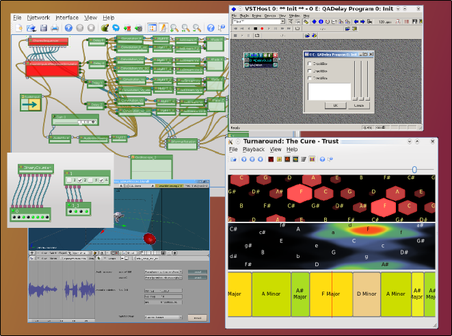

1.4.0, '3D molluscs in the space'
=================================

The CLAM project is delighted to announce the long awaited 1.4.0 release of [CLAM, the C++ framework for audio and music](http://clam-project.org), code name *3D molluscs in the space*.

In summary, this long term release includes a lot of new spacialization modules for **3D audio**; **MIDI**, **OSC** and **guitar effects** modules; architectural enhancements such as **typed controls**; nice **usability** features for the NetworkEditor interface; convenience tools and scripts to make CLAM experience better; enhanced building of LADSPA plugins and new support for **LV2 and VST** plugin building; a new easy to use application to explore songs chords called **Chordata**; many optimizations, bug fixing and code clean ups.

Some highlights of the release:

-   **Chordata** is a new CLAM application which offers a user friendly way to explore the chords of your favourite songs, using already existing technology in the CLAM framework but with a much simpler interface. [Video](http://www.youtube.com/watch?v=xVmkIznjUPE)

-   The **spacialization module** and helper tools, contributed by [Barcelona Media](http://barcelonamedia.org) audio group, turn CLAM in tandem with Blender and Ardour, into a powerful 3D audio authoring and exhibition platform. Here you can see some related [Video](http://www.youtube.com/watch?v=KSfqJUIAiXk).

-   **Typed controls** extend CLAM with the ability to use whichever C++ type as the message for a control. So, not just floats, but also bools, enums, integers, or envelopes can be sent as asynchronous controls. Examples on boolean and MIDI controls are provided.

-   NetworkEditor has been ported to the [QGraphicsView](http://doc.trolltech.com/latest/qgraphicsview.html) framework. Dealing with heavy networks such the big ones used in Barcelona Media have pushed many usability enhancements into its interface: multi-wire dragging, wire highlighting, default port and control actions, network and in-canvas documentation... [Video](http://www.youtube.com/watch?v=0kt0WDmvMwo)

-   It also made necessary to provide a tool such clamrefactor.py to perform batch high level changes to clam network XML files such as renaming processing types, ports, or configuration parameters, changing configuration values, duplicating sets of processings, connecting them...

-   **Music Annotator** application now is designed to aggregate several sources of descriptors and update them after edit. Descriptors are mapped to a work description schema that can be graphically defined. Also semantic web descriptor sources to access webservices such as MusicBrainz have been implemented.

You can download them from the [download page](http://clam-project.org/download/). Source, windows, debian and ubuntu packages are available. Contributed binaries for other platforms are welcome.

See also: [development screenshots](http://clam-project.org/wiki/Development_screenshots), the [CHANGELOG](http://clam-project.org/clam/trunk/CLAM/CHANGES), the [version migration guide](http://clam-project.org/wiki/Version_Migration_Guide) and the new [<http://www.youtube.com/group/clamproject>\# CLAM group on youtube].

Many thanks to the people who contributed to this release, including but not limited to the GSoC 2008 students and all the crew at Barcelona Media's Audio Group.

### Chordata 1.0.0

The CLAM project is pleased to announce the first stable release of Chordata.

Chordata is a simple but powerful application that analyses the chords of any music file in your computer. You can use it to travel back and forward the song while watching insightful visualizations of the tonal features of the song. Key bindings and mouse interactions for song navigation are designed thinking in a musician with an instrument at hands. Don't miss the demo video. [Video](http://www.youtube.com/watch?v=xVmkIznjUPE)

Downloat it at clam-project.org

### Mail version

`The CLAM project[1] is delighted to announce the long awaited 1.4.0 release of the C++ framework for Audio and Music, code name '3D molluscs in the space'.`
`[1] `[`http://clam-project.org`](http://clam-project.org)
`In summary, this long term release includes a lot of new spacialization modules for 3D audio; MIDI, OSC and guitar effects modules; architectural enhancements such as typed controls; nice usability features for the NetworkEditor interface; convenience tools and scripts to make CLAM experience better; enhanced building of LADSPA plugins and new support for LV2 and VST plugin building; a new easy to use application to explore songs chords called Chordata; many optimizations, bug fixing and code clean ups.`
`Some highlights of the release:`
`* Chordata is a new CLAM application which offers a user friendly way to explore the chords of your favourite songs, using already existing technology in the CLAM framework but with a much simpler interface. [2]`
`[2] `[`http://www.youtube.com/watch?v=xVmkIznjUPE`](http://www.youtube.com/watch?v=xVmkIznjUPE)
`* The spacialization module and helper tools, contributed by Barcelona Media [3] audio group, turn CLAM in tandem with Blender and Ardour, into a powerful 3D audio authoring and exhibition platform.[4] `
`[3] `[`http://barcelonamedia.org`](http://barcelonamedia.org)` `
`[4] `[`http://www.youtube.com/watch?v=KSfqJUIAiXk`](http://www.youtube.com/watch?v=KSfqJUIAiXk)
`* Typed controls extend CLAM with the ability to use whichever C++ type as the message for a control. So, not just floats, but also bools, enums, integers, or envelopes can be sent as asynchronous controls. Examples on boolean and MIDI controls are provided.`
`* NetworkEditor has been ported to the QGraphicsView [5] framework. Dealing with heavy networks such the big ones used in Barcelona Media have pushed many usability enhancements into its interface: multi-wire dragging, wire highlighting, default port and control actions, network and in-canvas documentation... [6]`
`[5] `[`http://doc.trolltech.com/latest/qgraphicsview.html`](http://doc.trolltech.com/latest/qgraphicsview.html)
`[6] `[`http://www.youtube.com/watch?v=0kt0WDmvMwo`](http://www.youtube.com/watch?v=0kt0WDmvMwo)
`* It also made necessary to provide a tool such clamrefactor.py to perform batch high level changes to clam network XML files such as renaming processing types, ports, or configuration parameters, changing configuration values, duplicating sets of processings, connecting them...`
`* Music Annotator application now is designed to aggregate several sources of descriptors and update them after edit. Descriptors are mapped to a work description schema that can be graphically defined. Also semantic web descriptor sources to access webservices such as MusicBrainz have been implemented.`
`You can download sources, windows, debian and ubuntu packages from the download page[7]. Contributed binaries for other platforms are welcome.`
`[7] `[`http://clam-project.org/download/`](http://clam-project.org/download/)` `
`See also:`
`Screenshots: `[`http://clam-project.org/wiki/Development_screenshots`](http://clam-project.org/wiki/Development_screenshots)
`Detailed changelog: `[`http://clam-project.org/clam/trunk/CLAM/CHANGES`](http://clam-project.org/clam/trunk/CLAM/CHANGES)
`Version migration guide: `[`http://clam-project.org/wiki/Version_Migration_Guide`](http://clam-project.org/wiki/Version_Migration_Guide)
`Youtube channel: `[`http://www.youtube.com/group/clamproject`](http://www.youtube.com/group/clamproject)
`Many thanks to the people who contributed to this release, including but not limited to the GSoC 2008 students and all the crew at Barcelona Media's Audio Group.`

1.3.0, 'Shooting flying plugins'
================================

 The CLAM team enraptured to announce the 1.3.0 release of [CLAM, the C++ framework for audio and music](http://clam.iua.upf.edu), code name *The Shooting of the Flying Plugins release*.

Highlights of this release are:

-   NetworkEditor [automatically generates and compiles](http://clam.iua.upf.edu/wikis/clam/index.php/Image:LadspaPropertiesDialog.png) a [LADSPA plugin](http://www.ladspa.org/) containing the network you are editing. CLAM also provides a [new simple API to code that by hand yourself](http://iua-share.upf.edu/wikis/clam/index.php/Building_a_LADSPA_plugin).
-   More [FAUST](http://faust.grame.fr) integration into network editor: edit faust code, compile, reload, view the svg diagrams (Natanael Olaiz GSoC)
-   Lots of usability enhancements on the NetworkEditor: cut&paste, context menus to connect ports, keyboard shortcuts, default double click actions, and a processing tree filter (Natanael Olaiz GSoC)
-   Annotator has also enhanced its functionality (Wang Jun GSoC):
    -   You can build a project that aggregates content from several extractors
    -   Extractors may have a config file
    -   Extractors can write back data (useful if the extractor is a database of webservice and needs to upload modifications)
-   New ProgressControl widget and paired AudioFileMemoryLoader processing to support seeking (Pawel Bartkiewicz GSoC)
-   A bunch of new 3D spatialization processings from [CI Barcelona Media](http://www.barcelonamedia.org/) audio research group.
-   [Scripts](http://audiores.uint8.com.ar/blog/2008/07/07/clam-processing-generator-script-example-of-use/) and [graphical front-end](http://clam.iua.upf.edu/wikis/clam/index.php/Image:ProcessingCodeGenerator.png) to generate a native CLAM plugin project from scratch.
-   [Experimental Python bindings](http://audiores.uint8.com.ar/blog/2008/08/03/interactive-clam-programming/) ([still just-for-hackers install procedure](http://iua-share.upf.edu/svn/clam/trunk/CLAM/pyclam/INSTALL))
-   TickExtractor example is compiling again (many thanks to Amaury Hazan from MTG-UPF)
-   Development deployment for Windows native compilation using MinGW (Wang Jun GSoC)

And a lot of small nice features and fixes you will appreciate for sure. Source and binary packages for different platforms are available at the [CLAM download page](http://clam.iua.upf.edu/download.html).

See also: [development screenshots](http://clam.iua.upf.edu/wikis/clam/index.php/Development_screenshots), the [CHANGELOG](http://iua-share.upf.edu/svn/clam/trunk/CLAM/CHANGES), and the [version migration guide](http://iua-share.upf.edu/wikis/clam/index.php/Version_Migration_Guide).

We are very excited on what next releases promise us. Some ongoing work:

-   Generating other types of network based plugins and programs (LV2, JACK, VST...),
-   Subnetworks (Natanael Olaiz GSoC)
-   Improved [OSC](http://opensoundcontrol.org/) support, 3D scene descriptors parametrization receivers processings and [Blender](http://www.blender.org/) exporter to the spatialization processing choreographer. (Natanael Olaiz GSoC - [related blogging](http://dadaisonline.blogspot.com/search/label/blender))
-   Typed controls (Francisco Tufro GSoC)
-   A new musician-oriented standalone [chord extraction application](http://iua-share.upf.edu/svn/clam/trunk/Turnaround/) (Pawel Bartkiewicz GSoC)

### Spanish short version

El equipo de [CLAM, the C++ framework for audio and music](http://clam.iua.upf.edu) está que trina de contento de anunciar la versión 1.3 del framework, alias *Disparando plugins voladores*. Esta versión incluye generación automatica de plugins [Ladspa](http://www.ladspa.org/) y programas [Faust](http://faust.grame.fr), un monton de mejoras en la usabilidad de la herramienta gráfica, más algoritmos de espacialización 3D, extracción de tempo y extracción de formantes, soporte al desarrollo nativo en Windows, extractores más flexibles para el Annotator...

En fin, un monton de cosas más. Mas información en el [anuncio oficial](http://clam.iua.upf.edu/).

### Freshmeat ultra short version

This release provides automatic generation of Ladspa plugins and Faust programs, a lot of usability enhancements on the graphical tool, more algorithms for 3D spatialization, rhythm analysis and formant extraction, support for native development in Windows, and more flexibility on Annotator's extractors.

### Mail Version

    The CLAM team enraptured to announce the 1.3.0 release of CLAM [1], the C++ framework for audio and music, code name ''The Shooting of the Flying Plugins release''. 

    Highlights of this release are:
    - Automatic binary generation of LADSPA plugins containing the network you are editing in NetworkEditor. Also a new simple API to code CLAM based Ladspa by hand. See [2]
    - More FAUST integration into network editor: edit faust code, compile, reload, view the svg diagrams (Natanael Olaiz GSoC)
    - Lots of usability enhancements on the NetworkEditor: cut&paste, context menus to connect ports, keyboard shortcuts, default double click actions, and a processing tree filter (Natanael Olaiz GSoC)
    - Annotator has also enhanced its functionality (Wang Jun GSoC):
      - You can build a project that aggregates content from several extractors
      - Extractors may have a config file
      - Extractors can write back data (useful if the extractor is a database of webservice and needs to upload modifications)
    - New ProgressControl widget and paired AudioFileMemoryLoader processing to support seeking (Pawel Bartkiewicz GSoC)
    - A bunch of new 3D spatialization processings from CI Barcelona Media[3] audio research group.
    - Scripts [4] and  graphical front-end [5] to generate a native CLAM plugin project from scratch.
    - Experimental Python bindings [6]
    - TickExtractor example is compiling again (many thanks to Amaury Hazan from MTG-UPF)
    - Development deployment for Windows native compilation using MinGW (Wang Jun GSoC)

    And a lot of small nice features and fixes you will appreciate for sure.
    Source and binary packages for different platforms are available at the CLAM download page [7]. See also: development screenshots [8], the CHANGELOG [9], and the version migration guide [10].

    We are also very excited on what next releases promise us. Some ongoing work:
    - Generating other types of network based plugins and programs (LV2, JACK, VST...),
    - Subnetworks (Natanael Olaiz GSoC)
    - Improved OSC support, 3D scene descriptors parametrization receivers processings and Blender exporter to the spatialization processing choreographer. (Natanael Olaiz GSoC) [11] 
    - Typed controls (Francisco Tufro GSoC)
    - A new musician-oriented standalone chord extraction application (Pawel Bartkiewicz GSoC)

    [1] http://clam.iua.upf.edu 
    [2] http://iua-share.upf.edu/wikis/clam/index.php/Building_a_LADSPA_plugin
    [3] http://www.barcelonamedia.org/ 
    [4] http://audiores.uint8.com.ar/blog/2008/07/07/clam-processing-generator-script-example-of-use/
    [5] http://clam.iua.upf.edu/wikis/clam/index.php/Image:ProcessingCodeGenerator.png
    [6] http://audiores.uint8.com.ar/blog/2008/08/03/interactive-clam-programming/
    [7] http://clam.iua.upf.edu/download.html 
    [8] http://clam.iua.upf.edu/wikis/clam/index.php/Development_screenshots
    [9] http://iua-share.upf.edu/svn/clam/trunk/CLAM/CHANGES
    [10] http://iua-share.upf.edu/wikis/clam/index.php/Version_Migration_Guide 
    [11] http://dadaisonline.blogspot.com/search/label/blender related blogging])
